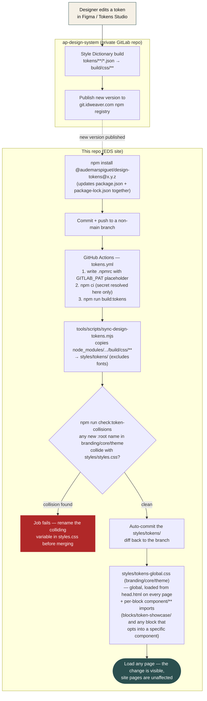

# AP Design Tokens Integration

## What this proves

This wires real, Figma-sourced Audemars Piguet design tokens — colors,
spacing, typography, and component variants (starting with
`button/primary`, `button/secondary`) — into this EDS site end-to-end, from
the published `@audemarspiguet/design-tokens` npm package through a small
vendoring step into both a global CSS layer and individual blocks. It's
built specifically so you can run this loop with a designer and show it
happening, and so any team member can build a new block against it:

1. A designer changes a value in the design system (Figma / Tokens Studio)
   and `ap-design-system` publishes a new package version.
2. You bump the version here and push.
3. The published change shows up on this site — visibly, without anyone
   hand-writing any CSS.

This started as an isolated proof of concept (a single demo block, to avoid
the two site-breaking failures documented below) and has since been
promoted to a real, global integration once those failures were fixed —
see "Fixing the sitewide rollout" below for what changed and why it's safe
now.

## Architecture

```
git.idweaver.com (private npm registry)
        │  npm install (authenticated via .npmrc + GITLAB_PAT)
        ▼
node_modules/@audemarspiguet/design-tokens/build/css/
        │  tools/scripts/sync-design-tokens.mjs
        │  (copies everything except build/css/fonts — this repo
        │   has its own font pipeline)
        ▼
styles/tokens/                     (generated — never hand-edited)
  ├── branding/default.css        (palette, radius, shadows, font families)
  ├── theme/day.css, night.css    (semantic color aliases)
  ├── core/spacing.css            (spacing scale, responsive)
  ├── core/typography.css         (type scale, responsive)
  └── component/**/*.css          (every component variant)
        │
        ├─ branding/, theme/day.css, core/**  @import'ed by
        │  styles/tokens-global.css (hand-authored, NOT inside
        │  styles/tokens/ — that directory is wiped on every resync),
        │  loaded from head.html on every page
        │
        └─ component/**  @import'ed per-block, only by the specific
           blocks that use that component (e.g.
           blocks/token-showcase/token-showcase.css)
```

The package is the single source of truth. Nothing in this repo re-derives
token values — `styles/tokens/` is generated output, regenerated by running
`npm run build:tokens`, never hand-edited. `styles/tokens-global.css` is the
one hand-authored file that decides which generated layers become global.

## Workflow diagram

The end-to-end loop, from a designer's change to it being visible on this
site:



## Fixing the sitewide rollout: what broke, and what changed

An earlier iteration of this integration linked the token CSS globally (in
`head.html`) and pointed the site's default CTA button at it via a small
change in `scripts/scripts.js`. That broke real pages, for two concrete
reasons:

1. **Variable name collisions with different meaning.** This site already
   defined `--spacing-xs`, `--spacing-xl`, and `--font-secondary-display-sm`
   in `styles/styles.css` with its own values — and in the case of
   `--font-secondary-display-sm`, an incompatible *shape*: a plain
   font-family list on this site vs. a full `font` shorthand
   (weight/style/size/line-height/family) in the design tokens. Overriding
   it sitewide didn't just change a number, it broke every consumer that
   expected a font-family list — which turned out to be **this site's own
   global rule plus three separate blocks** (`hero`, `columns`, `fragment`)
   that each independently do `font-family: var(--font-secondary-display-sm)`.
2. **One CSS class, applied blanket-wide, forced onto every button
   variant.** `decorateButtons` (in `aem.js`) produces three different
   button variants (plain, `.primary`, `.secondary`) from authored content.
   The earlier approach added the *primary* component's class to all three
   indiscriminately, so secondary/outline CTAs on real pages got silently
   repainted as solid black primary buttons, and the primary token's fixed
   sizing (`min-height: 64px`, `width: 100%`, `min/max-width: 260–320px`)
   didn't fit every context it landed in (cards, footer, nav).

Both problems are variations on the same root cause: **CSS custom
properties declared at `:root` are global by nature, not scopable** — so
anything that imports a token file globally affects every page, and any
class applied blanket-wide affects every element that class matches,
regardless of context.

**What's fixed now:**

1. The three colliding variables have been renamed in `styles/styles.css`
   to `--legacy-spacing-xs`, `--legacy-spacing-xl`, and
   `--legacy-font-secondary-display-sm`, with every consumer
   (`styles.css`'s own `h1 em`/`h2 em` rule, `blocks/hero`,
   `blocks/columns`, `blocks/fragment`, `blocks/login`) repointed to the
   renamed variable. There is no longer a name collision between this
   site's own tokens and the vendored ones.
2. `styles/tokens-global.css` imports the branding, `theme/day.css`, and
   core (spacing/typography) layers each assigned to the `ap-tokens` layer
   via `@import url(...) layer(ap-tokens);` (the `layer(...)` import
   modifier — not a wrapping `@layer ap-tokens { @import ...; }` block,
   which is invalid CSS since `@import` must be among the first rules in a
   stylesheet and can't be nested inside a block statement). With
   `styles/styles.css` loaded after it and therefore unlayered/higher
   priority, this is a safety net, not the primary fix: if a *future*
   token version reintroduces a colliding name, the site's own value wins
   the cascade instead of silently breaking a page.
3. `npm run check:token-collisions`
   (`tools/scripts/check-token-collisions.mjs`) runs in `tokens.yml` right
   after `npm run build:tokens` and fails the CI job if a newly-synced
   token version introduces a `:root`/`html`-scoped variable name that
   collides with anything declared in `styles/styles.css`. This turns the
   lesson from the incident above into an automatic check, so version
   bumps stay safe as more people do them (see "The version-bump loop"
   below).
4. Component-level tokens (`styles/tokens/component/**`) were never the
   problem — each is already scoped to a class selector (e.g.
   `.ap-button-primary--normal`), not `:root`. They stay **out** of
   `styles/tokens-global.css` on purpose (importing all ~35 of them
   globally would ship unused CSS to every page) and continue to be
   imported per-block, as `blocks/token-showcase/token-showcase.css`
   already demonstrates. The second failure above (blanket class
   application) is avoided by the consumption pattern in the next
   section — read the component's custom properties, don't apply its
   class to shared DOM.

## Consuming tokens in a new block

Two independent things are available to any block, and most blocks will
use both:

- **The global layer is free.** Any CSS anywhere in the site can already
  read `--color-palette-*`, `--color-reference-*` (day theme), `--radius-*`,
  `--shadow-*`, `--spacing-*`, `--font-size-*`, `--line-height-*`, etc. —
  no import needed, they're loaded from `styles/tokens-global.css` in
  `head.html` on every page.
- **Component tokens are opt-in, per block.** If your block corresponds to
  a component in the design system (a button, a quote, a banner, ...),
  `@import` only that specific file from `styles/tokens/component/**` in
  your block's own CSS, then read its custom properties under **your
  block's own selector** — don't apply the vendor's class
  (`.ap-button-primary--normal`) directly to DOM produced by shared logic
  like `decorateButtons`, since that logic doesn't know about token
  variants and will apply it indiscriminately:

  ```css
  @import url('/styles/tokens/component/input/button/primary.css');

  .my-block .cta-primary {
    background: var(--button-self-base-default-background-color);
    font: var(--button-self-base-default-text-font);
    padding: var(--button-self-base-default-padding);
  }
  ```

  This is the plain-CSS equivalent of how `ap-com` consumes the same
  package via SCSS `@extend` — adopt the token's *values*, not its class
  identity.

Before adding a brand-new `:root`/`html`-scoped custom property to
`styles/styles.css`, check it doesn't already exist in
`styles/tokens/branding/**`, `core/**`, or `theme/**` — `npm run
check:token-collisions` will catch it in CI either way, but it's cheaper to
notice while authoring.

## The showcase block

`blocks/token-showcase/` renders four sections, each labeled with the
source file it comes from:

- **Branding — color palette**: swatches for `--color-palette-black`,
  `white`, `green24`, `grey46`, `beige89`, `red42`, `blue38`.
- **Spacing scale**: a bar per step (`--spacing-5xs` through `--spacing-4xl`)
  at the small-breakpoint value, so a scale change is visually obvious.
- **Typography**: a label sample (`--font-primary-label-md`) and an italic
  display sample (`--font-secondary-display-sm`).
- **Button component**: a real primary and a real secondary button,
  rendered from `component/input/button/primary.css` /
  `secondary.css` — including their hover states.

### Adding it to a page

Author a block named **Token Showcase** anywhere on a dedicated demo page
(a single-cell table with that text, per standard EDS block-authoring
convention) — no other content required. `blocks/token-showcase/token-showcase.js`
replaces the block's content entirely with the rendered showcase.

## Setup (for a new machine / new team member)

The package lives on a private GitLab registry, so `npm install` needs
credentials:

1. Generate a GitLab personal access token at
   `https://git.idweaver.com/-/user_settings/personal_access_tokens`, scope
   `read_api` (or `read_package_registry`), with at least read access to
   the `audemarspiguet/ap-design-system` project.
2. Add it to your shell profile (not just the current terminal session —
   tooling that spawns its own shell won't see an ad hoc `export`):
   ```sh
   echo 'export GITLAB_PAT=<your-token>' >> ~/.zshrc
   source ~/.zshrc
   ```
3. Copy `.npmrc.template` to `.npmrc` (already gitignored) — it references
   `${GITLAB_PAT}` via npm's built-in env-var interpolation, so the token
   itself never touches disk or git history.
4. `npm install`

## Regenerating the token CSS

```sh
npm run build:tokens
```

Runs `tools/scripts/sync-design-tokens.mjs`, which wipes and re-copies
`styles/tokens/` from whatever version of `@audemarspiguet/design-tokens`
is currently installed. Review the diff before committing — it's meant to
be inspectable, not a black box. Run `npm run check:token-collisions`
afterwards (same check CI runs) if you want to confirm locally before
pushing.

## The version-bump workflow

Now that the collision guard is in place, **bumping the package version is
the standing way to pull in the latest design changes** — there's no
separate "promote to global" step to redo each time; branding, core, and
theme tokens are already global, and CI will catch a re-introduced naming
collision before it reaches a real page.

1. A designer changes a token value in Figma / Tokens Studio and
   `ap-design-system` publishes a new `@audemarspiguet/design-tokens`
   version.
2. In this repo:
   ```sh
   npm install @audemarspiguet/design-tokens@<new-version>
   ```
   (updates `package.json` and `package-lock.json` together — hand-editing
   just the version string will make CI's `npm ci` fail by design, rather
   than silently install a stale version).
3. Commit and push to a non-`main` branch.
4. `.github/workflows/tokens.yml` picks up the `package.json`/
   `package-lock.json` change, runs `npm run build:tokens`, then `npm run
   check:token-collisions`. If that check fails, the job stops **before**
   committing anything — rename the colliding variable in
   `styles/styles.css` (see "Consuming tokens in a new block" above) and
   push again. If it passes, the resulting `styles/tokens/` diff is
   auto-committed back to the branch.
5. Load any page (not just the Token Showcase demo) — the global layer's
   change (a palette color, a spacing step, a type size) is visible
   site-wide; a changed component token is visible on whichever blocks
   import that component.

Requires a `GITLAB_PAT` repository secret (Settings → Secrets and
variables → Actions) with the same scope as above — the workflow can't
authenticate to the private registry without it.

## Known limitations / follow-ups

- **Night theme is unused.** `theme/night.css` is vendored but not
  consumed anywhere — it's scoped to `html.theme-night`, a class this
  site's own theme switcher (`body.theme-light` / `body.theme-dark`) never
  sets. Reconciling the two naming schemes is a deliberate decision, not
  done here.
- **Only two components are demonstrated** (`button/primary`,
  `button/secondary`), as a representative proof. Adding more to the
  showcase block is mechanical repetition of the same pattern.
- **Font tokens** (`build/css/fonts/`) are intentionally excluded from the
  sync — this site already has its own font pipeline
  (`styles/fonts.css` + `/fonts`).
- **Rolling more components out to real blocks** beyond `button/primary`
  and `button/secondary` is mechanical, per-block work following the
  "Consuming tokens in a new block" pattern above — not a separate
  architectural effort anymore, since the global/per-block split and the
  collision guard are now in place.

## Relationship to the "local pipeline" POC

A separate, parallel POC explored duplicating the design system's Style
Dictionary build logic directly into this repo, deriving CSS from a local
copy of the token JSON (`tokens/`) without depending on the published npm
package at all. That approach is intentionally not present on this branch
— it answers a different question ("can we do this without ever
depending on the private package") and will be revisited separately.
